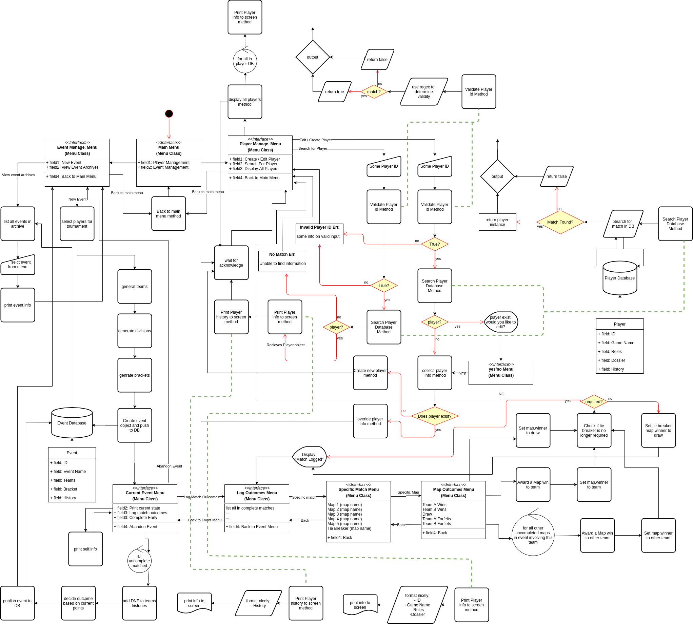

# **Overwatch Event Planner**

## **Software Development Plan**

### **Statement of Purpose and Scope**
Overwatch is a wonderful game with a healthy Esports scene. Lots of players enjoy watching the pros play and wish they could play in the same way. However it can be difficult for players to find community run competitions to play in and may find it difficult to organize a team. Also for the truly dedicated, the job of running a tournament can be daunting as well. This app will help both the community organizers and the players involved streamline this process by generating one day Open Division Pick-Up games style competitions.

#### **////// Overwatch Event Planner - What is it?**

Overwatch Event Planner is a terminal app that will provide Overwatch event organizers an easy way to create events by taking in information about players and storing them in a database. It will then use that database to create evenly matched teams with the right role distribution.[§](#myfootnote1) It will further make it easier for event planners by dividing these teams up automatically into the most appropriate brackets based on teams skill Finally it will help event organizers moderate and strengthen their communities by allowing them to log commendations and fouls that reported for teams which will then log them against the players. This will slowly build a dossier for the player that team managers can look to get a sense of the player for recruiting purposes. The plan for initial release will be to generate simple one day tournaments played with teams of randomly assigned players.

<a name="myfootnote1">§</a>: *Overwatch is played with teams of six player, there are three roles: Tank, Damage and Support. A team has two of each Role.*

#### **////// Overwatch Event Planner - Who will benefit?**

Obviously the target audience for this app is people who play competitive Overwatch. More specifically, individual players looking to start taking the game more seriously will benefit by having the barrier to entry of competitive play lowered. Team managers will benefit from having a dossier on potential recruits to give them better knowledge when recruiting. But the primary benefactor is the community builder. Players love a well run event and knowing they get a quality environment to play the game. By saving time on trying to plan the event community builders will have far more time to focus on content creation for social media and advertising there event and interacting with their community.

#### **////// Overwatch Event Planner - How will you use it?**

It till be very simple to use, just run the app in terminal and access the features selecting intuitive menu options with a combination of enter and arrow keys. Any data entry required will be done so via the keyboard and will have clear prompts when required.

### **Features**

#### **////// Create a database of Players**

Generating a database of players is crucial. This will be implemented by storing a large hash of Player Class objects that will include variables that represent there current game statistics, team position preferences and history of tournaments logged with the app. This information will be prompted from the player with a list of menus that will either ask for menu selections or text input from the command line. Most of this information will be will be able to updated as skill rating and player preferences change but player history will be read only. It will be important that all players have a unique name in the database to access there information.

#### **////// Generate a single elimination tournament with randomly generated teams**

The command will be selected from a menu prompt and then using the player database the app will generate random teams. The command will loop through the database and start with players that have the lowest skill rating and match them with players of similar skill. If there aren't enough players to form the last team, the event organizer will be warned and a list of player left out will be provided. Once all registered players have been assigned to teams it will split the teams into as many divisions of eight teams and generate a single elimination bracket for the division. If there isn't enough players to form the last eight team division, that division will not have a bracket generated. This event will be logged in a database of past events of the purpose of long term tracking of statistics. This is how all event information will be accessed.

#### **////// Provide access to specific pieces of information about event to help organize users**

Once the event have been generated users will be able to access specific information quickly through a menu. Players will be able to find out which team and division that they have been assigned to and organizers will be able to see a graphical representation of the matches that have been assigned.

------

### **User Interaction and Experience**

#### Error handling
As a lot of this app is selecting menus, there isn't many ways that users can get into trouble. However the times they are required to enter input the gem TTY-Prompt handles the errors and tells users what has gone wrong

#### User Stories
###### As a *Player*, I *want to* register my information, *so that* I can be considered for upcoming events.
As a player, I open the the app. Immediately I am presented with a menu choice and prompted to use my arrow keys and enter to select one, these choices are:
- Player Management
- Event Management
- Quit

As I neither want to quit or create an event, I select **Player Management**. I am then present with another menu this time with the following options:
- Create / Edit Player
- Search for Player
- Display All Players
- Back to Main Menu

As I want to enter my information for the first time I select the **create** option. The app then prompts me for my player information. As an experienced Overwatch player I understand any jargon but in the case I do enter something incorrectly the prompt tells I have incorrectly entered information and lets me know the form the information should take. Once I have entered my information I am notified that the player database has been updated.

###### As a *Organiser*, I *want to* creat an event, *so that* I can host it.
I open the the app. Immediately I am presented with a menu choice and prompted to use my arrow keys and enter to select one, these choices are:
- Player Management
- Event Management
- Quit

As the information I am looking for is about an **Event**, I select Event Management. I am the presented with the following menu:
- Create Event
- View Event Information
- Quit

A I want to **create** an event, so i select the create event option. An alert tells me to be patient. after a few moments i am told the event has been created and I'm taken back to the menu.

###### As a *Event Organiser*, I *want to* see information about matches, *so that* I can provide that information with participating players.
I open the the app. Immediately I am presented with a menu choice and prompted to use my arrow keys and enter to select one, these choices are:
- Player Management
- Event Management
- Quit

A I want to view **infomation** about an event I select View Event Information. I am then presented with a list of events that have happened or are going to happen. I recognize the date and name of the event I am interested in so I navigate to that event and press enter. I am then presented with the following menu:
- Display Divisions
- Display Teams
- Display Matches
- Display Players
- Find Player

I am interested in the **Matches** so i select "Display Matches". When I do i am presented with a menu of each division in the event. As the Organizer i already know which division i am interested about so i select the correct one. I then recieve a print out graphically depicting the matches that need to take place in that division.

------

### **Control Flow Diagram**

------

## **Implementation Plan**

Summary of implementation plan. Include the following

- **outlines** how each feature will be implemented and a checklist of tasks for each feature
- prioritise the implementation of different features, or checklist items within a feature
- provide a deadline, duration or other time indicator for each feature or checklist/checklist-item

I put a link to my Trello here and screenshot below

------

## Testing

Quick summary of testing. You can say you used your tests written here and then maybe a table showing you did some manual testing or a screenshot of an excel doc showing the same.

------

## **Author**

Daniel John Keefer, also known as xxKeefer
